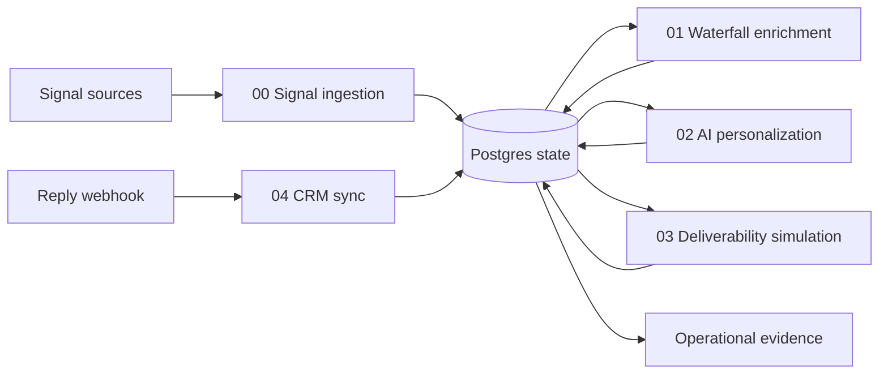

# Signal-to-CRM Outbound Pipeline — Architecture

**Author:** Manus AI  
**Version:** 1.0 concept-project architecture  
**Status:** Pilot-ready skeleton; not production infrastructure

## Executive summary

This project converts a loosely connected outbound prospecting process into five independently triggerable n8n workflows backed by PostgreSQL state. The architecture is intentionally modular: each workflow owns exactly one business phase, reads rows produced by the preceding phase, writes rows for the next phase, and can be executed or tested without requiring a synchronous chain.

The design is optimized for credibility and controlled experimentation rather than maximum throughput. It uses genuine calls to Apify, Apollo, Hunter, Gemini, public homepages, DNS, and Slack where the provider boundary is approved. Where the real destination would require paid infrastructure or an operationally risky mailbox swarm, the algorithm is preserved and the destination is explicitly simulated with Postgres. This makes the project demonstrable without claiming production capabilities it does not yet have.

## System context

The system starts from a business signal such as a support-related job posting or a detected website technology gap. It normalizes and deduplicates the signal, resolves a contact through a waterfall, generates a research-backed hook, applies cap-aware send scheduling, and classifies replies into an adapter-shaped CRM handoff. Operational evidence is captured alongside business rows so the project can prove not only that it ran, but also which provider tier was used and what failure or cap condition occurred.

The workflow files use n8n’s JSON import format. n8n officially supports importing and exporting workflows as JSON; exported files can include credential names and IDs, which is why this repository uses only credential references and environment-variable expressions rather than secrets [1]. The HTTP Request nodes follow n8n’s documented generic-credential model for REST services and expose timeout, body, and fail-soft configuration [2]. Programmatic deployment through the n8n REST API is optional because the current API documentation notes plan availability constraints; editor import is the default fallback [3].

## Workflow boundaries

| Workflow | Trigger | Reads | Writes | External boundaries | Realism label |
|---|---|---|---|---|---|
| `00_signal_trigger` | Six-hour schedule | Provider responses or fixtures | `signal_events`, `workflow_runs` | Apify, homepage fetch | Real with fixture mode |
| `01_waterfall_enrich` | Fifteen-minute schedule | `signal_events.status='new'` | `prospects_enriched`, usage ledger; marks input enriched | Apollo, Hunter, DNS | Real |
| `02_ai_personalize` | Thirty-minute schedule | Resolved prospects | `personalization_hooks`; marks input personalized | Homepage fetch, Gemini | Real |
| `03_deliverability_sim` | Thirty-minute schedule | New hooks and mailbox capacity | `send_queue`, cap audit; marks input queued | Optional single sandbox Gmail | Simulated |
| `04_crm_sync` | Reply webhook | Reply payload | `replies_inbox`, optional `crm_leads`, SLA audit | Gemini, Slack | Hybrid |

The state boundary is deliberately PostgreSQL polling rather than synchronous sub-workflow calls. This permits Workflow 2 to be rerun against a selected batch without retriggering signal collection or delivery simulation. The trade-off is latency: a row may wait until the next schedule tick. A future production revision can replace polling with `LISTEN/NOTIFY` or a message queue without changing the business tables or adapter contracts.

## Data and control planes

The **business data plane** consists of the phase tables: `signal_events`, `prospects_enriched`, `personalization_hooks`, `mailbox_registry`, `send_queue`, `replies_inbox`, and `crm_leads`. The **control and evidence plane** consists of `workflow_runs`, `integration_usage`, and `audit_log`. Separating these planes makes the case study stronger because a reviewer can inspect the outcome and the operational explanation independently.

The primary state machine is:

| Table | Initial state | Transition | Meaning |
|---|---|---|---|
| `signal_events` | `new` | `enriched` or `rejected` | Signal is ready for contact resolution or excluded. |
| `prospects_enriched` | `new` | `personalized` or `dead` | Contact has been resolved, then either receives a hook or is held. |
| `personalization_hooks` | `new` | `queued` | Hook is ready for the cap-aware send queue. |
| `send_queue` | `queued` | `sent`, `capped`, `failed` | A scheduling decision has been made. |
| `replies_inbox` | `classification=NULL` | classified | Raw replies are retained with normalized intent. |
| `crm_leads` | `new_lead` | operator-managed | Interested replies have an adapter-shaped CRM record. |

## Reliability and failure handling

Every external HTTP, Gmail, or Slack node is configured to continue on failure. That setting is not treated as “ignore the error”; downstream Code and Postgres nodes turn the failure into an explicit fallback, audit row, or safe state. Apollo failure does not invent an email; it enables the Hunter branch or creates an unresolved tier. A homepage failure does not poison the whole batch. A Slack failure does not undo CRM persistence. A zero-mailbox condition fails loudly rather than silently dropping queued work.

The generated validator enforces graph integrity, reachable nodes, external-call fail-soft settings, expression references, and the presence of state mutations in stateful phases. The only deliberate exception is Workflow 00’s phase-output insert: a new signal must remain `new` so Workflow 01 can consume it.

## Deployment options

| Approach | Tradeoffs | Cost | Setup complexity |
|---|---|---:|---:|
| Import JSON in an existing n8n instance and configure credentials manually | Fastest path; relies on the operator’s existing n8n hosting and database | Depends on existing n8n/Postgres | Low |
| Import JSON, then push and activate through the n8n public API | Repeatable CI/CD-style deployment; requires API access and careful versioning | Depends on n8n plan/hosting | Medium |
| Rebuild the logic in a custom application with background jobs | More control over queues, UI, observability, and tenancy; loses n8n’s visual proof and takes longer | Engineering and hosting cost | High |

The recommended concept-project route is the first option: import the JSON files, apply the SQL schema, configure credentials, run fixture tests, then decide whether REST deployment is worth adding. The second option is a credible next step for a team that wants repeatable promotion across environments.

## Production revision path

The production version should preserve the phase tables and adapter boundaries while adding a proper queue, idempotency keys on provider callbacks, provider-specific retry policies, secret-manager integration, privacy retention controls, CRM field mappings, and a real sending provider only after compliance and deliverability requirements are approved. The current project is therefore not a disguised production claim; it is a controlled slice that proves the highest-leverage engineering ideas: stateful modularity, waterfall economics, fail-soft handling, cap enforcement, and adapter replacement.

## References

[1]: https://docs.n8n.io/build/manage-workflows/export-and-import "n8n — Export and import workflows"
[2]: https://docs.n8n.io/integrations/builtin/core-nodes/n8n-nodes-base.httprequest "n8n — HTTP Request node"
[3]: https://docs.n8n.io/connect/n8n-api "n8n — API documentation"
